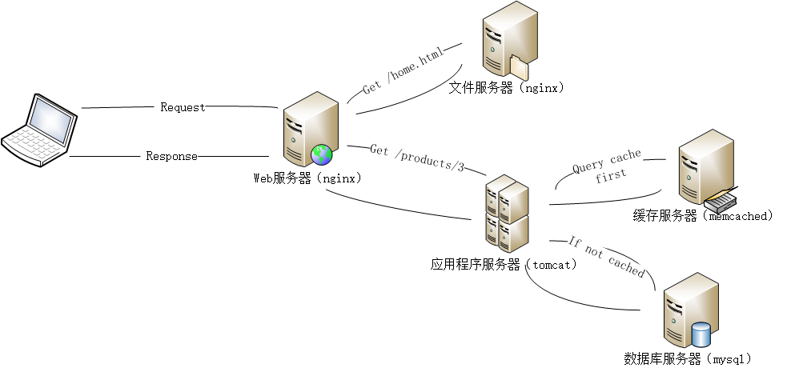
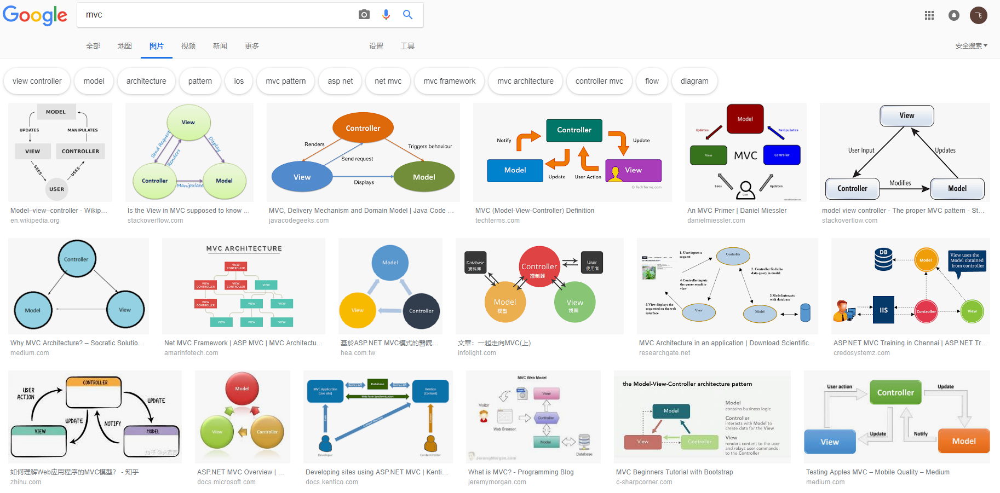
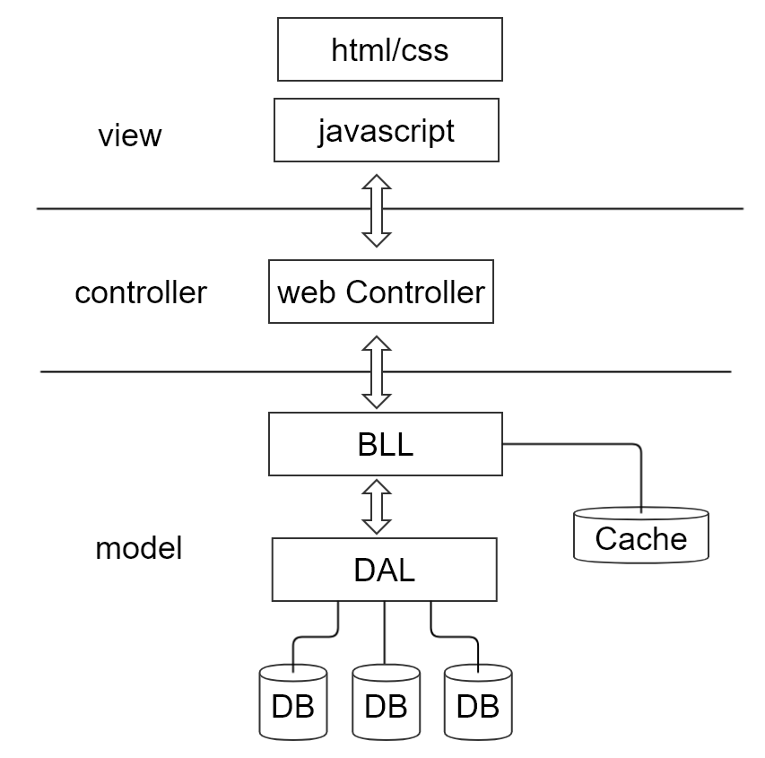

# A Tour of Web Development <!-- omit in toc -->

- [客户端与服务器交互方式](#%e5%ae%a2%e6%88%b7%e7%ab%af%e4%b8%8e%e6%9c%8d%e5%8a%a1%e5%99%a8%e4%ba%a4%e4%ba%92%e6%96%b9%e5%bc%8f)
  - [示意图](#%e7%a4%ba%e6%84%8f%e5%9b%be)
  - [推荐资料](#%e6%8e%a8%e8%8d%90%e8%b5%84%e6%96%99)
- [Web Application](#web-application)
  - [Web后端常见技术](#web%e5%90%8e%e7%ab%af%e5%b8%b8%e8%a7%81%e6%8a%80%e6%9c%af)
  - [Servlet示例](#servlet%e7%a4%ba%e4%be%8b)
    - [HelloWorldServlet](#helloworldservlet)
    - [A Real Servlet](#a-real-servlet)
  - [Servlet缺点](#servlet%e7%bc%ba%e7%82%b9)
- [模板引擎](#%e6%a8%a1%e6%9d%bf%e5%bc%95%e6%93%8e)
  - [JSP](#jsp)
  - [Thymeleaf](#thymeleaf)
  - [Spring template engines](#spring-template-engines)
  - [推荐学习](#%e6%8e%a8%e8%8d%90%e5%ad%a6%e4%b9%a0)
- [MVC](#mvc)
  - [框架关系图](#%e6%a1%86%e6%9e%b6%e5%85%b3%e7%b3%bb%e5%9b%be)
  - [Why MVC](#why-mvc)
- [Ajax及SPA的出现（后端技术思想在前端的应用）](#ajax%e5%8f%8aspa%e7%9a%84%e5%87%ba%e7%8e%b0%e5%90%8e%e7%ab%af%e6%8a%80%e6%9c%af%e6%80%9d%e6%83%b3%e5%9c%a8%e5%89%8d%e7%ab%af%e7%9a%84%e5%ba%94%e7%94%a8)
  - [SSR和CSR](#ssr%e5%92%8ccsr)
  - [Javascript Template Engines](#javascript-template-engines)
  - [前端路由](#%e5%89%8d%e7%ab%af%e8%b7%af%e7%94%b1)
  - [MVC/MVP/MVVM框架](#mvcmvpmvvm%e6%a1%86%e6%9e%b6)
  - [SPA的优缺点](#spa%e7%9a%84%e4%bc%98%e7%bc%ba%e7%82%b9)
  - [提问](#%e6%8f%90%e9%97%ae)
- [前后端分离探索](#%e5%89%8d%e5%90%8e%e7%ab%af%e5%88%86%e7%a6%bb%e6%8e%a2%e7%b4%a2)
  - [前后端代码结构图](#%e5%89%8d%e5%90%8e%e7%ab%af%e4%bb%a3%e7%a0%81%e7%bb%93%e6%9e%84%e5%9b%be)
  - [SPA式的分离](#spa%e5%bc%8f%e7%9a%84%e5%88%86%e7%a6%bb)
  - [大前端式的分离（将SPA与传统方式结合）](#%e5%a4%a7%e5%89%8d%e7%ab%af%e5%bc%8f%e7%9a%84%e5%88%86%e7%a6%bb%e5%b0%86spa%e4%b8%8e%e4%bc%a0%e7%bb%9f%e6%96%b9%e5%bc%8f%e7%bb%93%e5%90%88)
  - [推荐学习](#%e6%8e%a8%e8%8d%90%e5%ad%a6%e4%b9%a0-1)
- [前端技术梳理](#%e5%89%8d%e7%ab%af%e6%8a%80%e6%9c%af%e6%a2%b3%e7%90%86)
  - [提升开发效率](#%e6%8f%90%e5%8d%87%e5%bc%80%e5%8f%91%e6%95%88%e7%8e%87)
  - [代码规范](#%e4%bb%a3%e7%a0%81%e8%a7%84%e8%8c%83)
  - [部署](#%e9%83%a8%e7%bd%b2)
- [总结](#%e6%80%bb%e7%bb%93)
  - [现状](#%e7%8e%b0%e7%8a%b6)
  - [期望](#%e6%9c%9f%e6%9c%9b)

## 客户端与服务器交互方式

### 示意图

  

### 推荐资料

[《大型网站技术架构》](https://book.douban.com/subject/25723064/) ———— 了解服务器架构演变的科普图书。  

[《图解HTTP》](https://book.douban.com/subject/25863515/) ———— 简单易懂，语言流畅，适合入门阅读。  

[《HTTP权威指南》](https://book.douban.com/subject/10746113/) ———— 进阶版，讲解深入原理，高手之路必读。  
  
## Web Application

### Web后端常见技术

1. JavaEE家族（Java、servlet&jsp、Spring、MyBatis/Hibernate、Apache、tomcat/JBoss/WebLogic)
2. .Net家族（C#、asp.net、.NET Framework、IIS）
3. LAMP（Linux、Apache、Mysql、PHP）

### Servlet示例

#### HelloWorldServlet

``` Java
import java.io.*;
import javax.servlet.*;
import javax.servlet.http.*;

public class HelloWorld extends HttpServlet {
    private String message;

    public void init() throws ServletException {
        message = "Hello World";
    }

    public void doGet(HttpServletRequest request, HttpServletResponse response) throws ServletException, IOException {
        response.setContentType("text/html");

        PrintWriter out = response.getWriter();
        out.println("<h1>" + message + "</h1>");
    }  

    public void destroy() {
    }
}
```

#### A Real Servlet

``` Java
public class HelloForm extends HttpServlet {

    protected void doGet(HttpServletRequest request, HttpServletResponse response) throws ServletException, IOException {
        response.setContentType("text/html;charset=UTF-8");

        PrintWriter out = response.getWriter();
        String title = "使用 GET 方法读取表单数据";
        // 处理中文
        String name =new String(request.getParameter("name").getBytes("ISO8859-1"),"UTF-8");
        String docType = "<!DOCTYPE html> \n";
        out.println(docType +
            "<html>\n" +
            "<head><title>" + title + "</title></head>\n" +
            "<body bgcolor=\"#f0f0f0\">\n" +
            "<h1 align=\"center\">" + title + "</h1>\n" +
            "<ul>\n" +
            "  <li><b>站点名</b>："
            + name + "\n" +
            "  <li><b>网址</b>："
            + request.getParameter("url") + "\n" +
            "</ul>\n" +
            "</body></html>");
    }
}
```

### Servlet缺点

1. 开发效率低下
2. 容易出bug
3. 难以维护
4. 要求程序猿必须具备全栈能力

## 模板引擎

### JSP

``` Java
// ProductServlet.java
public class ProductServlet extends HttpServlet {
    public void doGet(HttpServletRequest request, HttpServletResponse response){

        String name = request.getParam("name");
        List<Product> products = ProductService.search(name);

        request.setAttribute("products", products);

        RequestDispatcher rd = getServletContext().getRequestDispatcher("/products.jsp");
        rd.forward(request,response); 
    }
}
```

``` html
<!-- products.jsp -->
<%@ page language="java" contentType="text/html; charset=UTF-8"
    pageEncoding="UTF-8"%>
<%@ taglib uri="http://java.sun.com/jsp/jstl/core" prefix="c" %>
<html>
    <body>
        <c:forEach items="products" var="prod">
            <div class="product">
                <p>${prod.name}</p>
                <p>${prod.price}</p>
            </div>
        </c:forEach>
    </body>
</html>
```

### Thymeleaf

``` html
<!DOCTYPE html>
<html lang="en">
    <body>
        <div th:each="prod: ${products}" class="product">
            <p th:text="${prod.name}">苹果</p>
            <p th:text="${prod.price}">5.5元/斤</p>
        </div>
    </body>
</html>
```

### Spring template engines

- JMustache
- Thymeleaf
- Groovy
- Pebble
- Apache Velocity
- Apache FreeMarker

参考：[https://www.baeldung.com/spring-template-engines](https://www.baeldung.com/spring-template-engines)

### 推荐学习

- [《Head First Servlets & JSP》](https://book.douban.com/subject/1942934/) ———— java web程序猿必读。  
- [《How Tomcat Works》](https://book.douban.com/subject/1943128/) ———— tomcat是servlet容器，了解了servlet是什么之后应该会比较好奇容器的工作原理。  

## MVC

当应用变的复杂，仅仅应用模板技术不能解决业务复杂度增加引起的程序复杂度指数式升高，这时候便需要进入MVC架构。

MVC要实现的目标是**将软件用户界面(View)和业务逻辑(Model)分离**以使代码可扩展性、可复用性、可维护性、灵活性加强。  
  
Controller扮演什么角色呢？在软件开发领域有一句俗话：**“没有什么解耦问题是不能通过加一个抽象层解决的，如果有，那就加两层。”**  
  
哈哈，这不是一句玩笑话，是真的这么回事，MVC再一次证明了这句话的正确性，Controller就是这样一个负责在Model和View中间斡旋的抽象层。  
  
### 框架关系图

  

从上面的Google结果图可以看出，如今已经找不到一个定式的MVC关系图，从[MVC被提出](http://wiki.jikexueyuan.com/project/javascript-design-patterns/mvc.html)在现在，在不同技术领域，都发展出了[适合各自场景的MVC](https://zh.wikipedia.org/wiki/MVC#%E5%AE%9E%E7%8E%B0)。  

其实MVC更应该称作一种设计思想，而不是设计模式，实现MVC往往需要几种设计模式的组合使用，比如【观察者模式】，当Model被改变时，它会通知观察者(View)一些东西已经被更新了；【策略模式】，当用户操作view时，controller做出不同响应（操作model）。  

### Why MVC

> 假设需求1：小明想做一个卖衣服的程序，可以在web和手机app上向全世界卖衣服。  
> 假设需求2：web网站主要作为营销渠道，需要根据用户的喜好频繁调整页面样式，达到吸引用户购买的目的。

``` Java
// com.demo.controller.web.WebProductServlet.java
public class WebProductServlet extends HttpServlet {
    public void doGet(HttpServletRequest request, HttpServletResponse response){

        String name = request.getParam("name");
        List<Product> products = ProductService.search(name);

        request.setAttribute("products", products);

        RequestDispatcher rd = getServletContext().getRequestDispatcher("/products.jsp");
        rd.forward(request,response); 
    }
}

// com.demo.controller.app.ProductServlet.java
public class AppProductServlet extends HttpServlet {
    public void doGet(HttpServletRequest request, HttpServletResponse response){

        String name = request.getParam("name");
        List<Product> products = ProductService.search(name);

        response.setAttribute('products', products.toJsonString());
    }
}

// Model 部分可以复用
// com.demo.model.ProductService.java
public class ProductService {

    public static List<Product> search(name){
        List<Product> products = new ArrayList<Product>();

        /- 
            code for search products by name...
        */

        return products;
    }
}
```

``` html
<!-- products.jsp --> 
<!-- 页面样式可随意改动，不影响业务逻辑代码 --> 
<%@ page language="java" contentType="text/html; charset=UTF-8"
    pageEncoding="UTF-8"%>
<%@ taglib uri="http://java.sun.com/jsp/jstl/core" prefix="c" %>
<html>
	<body>
		<c:forEach items="products" var="prod">
			<div class="product">
				<p>${prod.name}</p>
		   		<p>${prod.price}</p>
			</div>
		</c:forEach>
	</body>
</html>
```

常见的SpringMVC、Struts都是针对JAVA开发的第三方MVC框架。  

## Ajax及SPA的出现（后端技术思想在前端的应用）

Ajax技术的诞生是前端发展的重要里程碑。

配合Google V8 JS引擎的问世，使得web页面可以仅靠JS调用http service完成所有页面的渲染工作。这便是SPA(Single Page Application)的概念，这里有[一个简单的SPA demo](https://github.com/chinaoarq/studio/tree/master/web%20common/spa_demo)。  

从上文的demo可以看出SPA其实只有初始加载的时候生成一个document，往后的页面变化都是利用ajax请求server数据然后利用JS动态渲染DOM实现的，这也是SPA能够提供沉浸式体验的重要原因。  
JS动态渲染DOM主要有两种方式：  

### SSR和CSR

Server Side Rendering(eg. Jsp) VS Client Side Rendering(eg. Js build DOM)  

- SSR充分利用服务器计算能力，在弱客户端环境下具有一定优势
- CSR无需编码人员具有server知识，开发部署都不需要与后端协作

### Javascript Template Engines

同Java Template Engines一样，前端也有模板引擎，可以看做后端思想在前端的应用。常见模板举例：
- Mustache
- Handlebars
- Underscore
- jTemplates

### 前端路由

从上文的demo可以看出SPA其实只有初始加载的时候生成一个document，往后的页面变化都是利用ajax请求server数据然后利用JS动态渲染DOM实现的，这也是SPA能够提供沉浸式体验的重要原因。但现在有一个致命问题，在SPA中，从A页面跳到B页面时url不会变化。  
但我们需要url跟随页面一起变化，就像传统网站那样。因为url不随页面变化的方式是很不友好的，会导致用户没有办法使用浏览器的‘前进’‘后退’‘刷新’，也不能把某一个页面保存为‘书签’。

解决这个问题有一下两种方式：

- [History API](https://developer.mozilla.org/en-US/docs/Web/API/History) HTHM5新特性，URL漂亮，但不是全部浏览器都支持，上文的demo采用的就是这种
- [location.hash](https://developer.mozilla.org/en-US/docs/Web/Events/hashchange) URL不漂亮，但是支持的浏览器多，[网易云音乐](https://music.163.com/#/discover/toplist)就是这种

### MVC/MVP/MVVM框架

SPA的方式相当于把大量后端逻辑移到了前端，当前端逻辑变得复杂，便有人想到了已在其他领域应用多年的MVC。MVC的主要目的是分离视图与业务逻辑，使得代码结构清晰易维护，在上文已经讲过（我们的SPA demo中使用MVC模式实现了一个TODO List应用）。  

就像Java后端有SpringMVC、Struts一样，前端也有很多MV*框架： 

- VUE
- React
- Backbone.js
- KnockoutJS
- AngularJS
- EmberJS

如果想了解每个框架的特点，推荐一个很好的[框架对比网站](http://todomvc.com/) 。

### SPA的优缺点

- +局部刷新、增删改等场景下用户体验很好
- +方便缓存、可以离线使用

- -Not friendly to SEO
- -首屏加载不够快
- -单个页面Ajax太多时，手机环境下性能有瓶颈
- -暴露接口增加网站不安全性
- -完全的没有后端，不能做bigpipe等依赖服务器性能优化

### 提问

> SPA如何部署，需要注意哪些事项？  
> Tip：静态文件缓存更新问题

## 前后端分离探索

### 前后端代码结构图


[前后端协作方式的不断演变](https://github.com/lifesinger/blog/issues/184)

### SPA式的分离

- +对后端依赖最小，每个迭代只要api文档定好，就可以和后端同步开发
- +可以独立部署，不依赖与后端代码
- -SPA的弱点

### 大前端式的分离（将SPA与传统方式结合）

**Why?**

1. SPA只能异步渲染，对SEO不友好
    所谓异步渲染就是ajax等方式得到html，从发送请求到得到html的过程中可以继续做其他事情；相对的同步渲染也就server直出html，即在请求页面时直接返回页面html。
    异步渲染对SEO不够友好，因为搜索引擎爬虫不会等到动态内容渲染结束后再爬取网页。
2. SPA对首屏加载的优化手段有限
   1. 必须等待JS加载完成后，再调用ajax获得页面需要的html，没有同步渲染快
   2. 无法使用bigpipe等服务器端优化手段
3. SPA依赖客户端计算能力，对于弱客户端环境（手机浏览器、3G网络等）体验不好

**What**  
把上图中的controller层也归到前端团队。  
这不等于说放弃SPA，目前有[支持优雅降级的pjax](https://github.com/chinaoarq/studio/blob/master/web%20common/pjax.html)可以将SPA与传统方式结合，在高端浏览器上使用pushState+ajax，低端浏览器上自动使用传统方式。此外也可以自由设定某些页面不使用pjax，以加快首屏加载。  

### 推荐学习

- [淘宝：前后端分离的思考与实践](http://taobaofed.org/blog/2014/04/05/practice-of-separation-of-front-end-from-back-end/)
- [淘宝：新版卖家中心 Bigpipe 实践](http://taobaofed.org/blog/2015/12/17/seller-bigpipe/)
- [turbolink：现成的pjax解决方案](https://github.com/turbolinks/turbolinks)
- [javascript MV*模式](http://wiki.jikexueyuan.com/project/javascript-design-patterns/mvc.html)
- [现代前端技术解析](https://book.douban.com/subject/27021790/)

## 前端技术梳理

### 提升开发效率

- css转译：sass/Less/pass/postCSS  
- css工具库：bootstrap css  
- JS转译：babel  
- JS工具库：jquery/undersocre/axios  
- JS模块化：AMD/CMD/Commonjs/Seajs  
- JS库管理工具：npm/Bower

JS框架：

- VUE
- React
- Backbone.js
- KnockoutJS
- AngularJS
- EmberJS

### 代码规范

- jslint
- csslint

### 部署

- webpack  
    js压缩、js混淆、css压缩、图片压缩、icon sprite、cdn地址替换、sass预编译、postCSS编译...
- gulp  
- grunt  
- fis3  
- rollup   

## 总结

### 现状

> 乱花渐欲迷人眼，浅草才能没马蹄。  

### 期望

> 不畏浮云遮望眼，自缘身在最高层。
